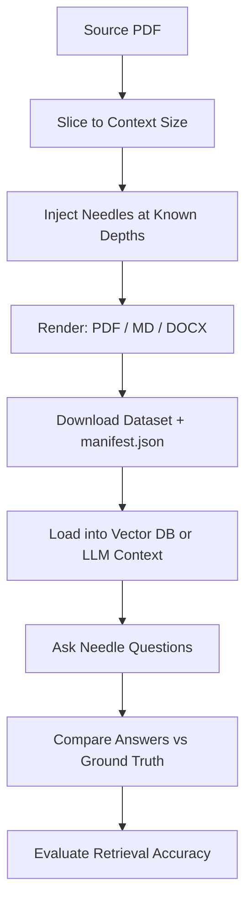

# niah-generator

[](https://github.com/heptafox/niah-generator)
[](LICENSE)
[](https://openjdk.org/projects/jdk/21/)
[](https://spring.io/projects/spring-boot)
[](https://maven.apache.org/)
[](https://github.com/heptafox/niah-generator)
[](https://github.com/heptafox/niah-generator/stargazers)

Generate deterministic **Needle-in-a-Haystack (NIAH)** benchmark datasets for evaluating Retrieval-Augmented Generation (RAG), Agentic AI workflows, vector databases, MCP servers, and long-context Large Language Models (LLMs).

Built with **Spring Boot 4** and **Java 21**.

<!-- TODO: add screenshot at docs/images/homepage.png -->
<!--
<p align="center">
  
</p>
-->

---

## What is Needle-in-a-Haystack?

A long document is the **haystack** (the bundled *Pride and Prejudice* novel by default). Intentionally-incorrect facts — the **needles** — are injected at known depths. You then ask your system the matching question and check whether it answers from the document or from the model's pre-trained knowledge.

> **Example:** a model knows *the capital of France is Paris*. We inject *the capital of France is New York*. Ask "What is the capital of France?" — a document-grounded system answers **New York**; if it answers **Paris**, it ignored the document and relied on training data.

- 📖 **Haystack** — the source document (a PDF)
- 🪡 **Needle** — one unique counterfactual fact injected per segment, at a known depth
- ✅ **Expected behavior** — a grounded RAG/LLM answers using the injected fact, not training data

---

## Who is this for?

| Role | Why |
|---|---|
| **RAG Developers** | Benchmark retrieval accuracy and grounding before shipping |
| **AI / GenAI Engineers** | Stress-test context windows and document understanding |
| **Agentic AI Developers** | Verify agents use provided context over pre-trained knowledge |
| **MCP Server Developers** | Evaluate MCP-powered retrieval end-to-end |
| **Platform / ML Engineers** | Build reproducible evaluation pipelines across model versions |
| **LLM Researchers** | Run controlled NIAH experiments with deterministic placement |

---

## Use Cases

- **RAG evaluation** — measure whether your retrieval pipeline surfaces the right context
- **Long-context LLM testing** — probe how well a model attends to content at different depths
- **Hallucination detection** — surface cases where a model ignores retrieved facts
- **Grounding verification** — confirm answers are backed by the provided document
- **Vector database benchmarking** — compare retrieval quality across embedding models and indices
- **AI agent evaluation** — test whether agents prefer document context over training knowledge
- **MCP server testing** — validate context injection through MCP tool calls
- **Enterprise AI evaluation** — generate repeatable test suites for internal compliance reviews

---

## Quick Start

```bash
git clone https://github.com/heptafox/niah-generator.git
cd niah-generator
./mvnw spring-boot:run     # UI at http://localhost:8080
```

Other commands:

```bash
./mvnw clean package       # build
./mvnw test                # run tests
python3 scripts/gen_niah.py  # standalone Python generator → dataset/
```

Pick a context size, choose **isolated** (easy — needle on its own line) or **embedded** (hard — blended into surrounding prose) placement, and download. Tick the **answer key** box to get a `.zip` containing the document plus a `manifest.json` listing every needle and its exact location.

---

## Output

Each generated dataset contains:

```text
dataset/
├── dataset.pdf       # Full haystack with injected needles (PDF)
├── dataset.md        # Same content as Markdown
├── dataset.docx      # Same content as DOCX (Word)
└── manifest.json     # Needle locations, depths, questions, and ground-truth answers
```

The `manifest.json` answer key records the `charOffset`, `depthPercent`, question, and ground-truth answer for every injected needle — ready to plug into your evaluation harness.

---

## Agent Crawl (second tab)

The UI has two tabs. The **RAG datasets** tab downloads the files above. The **Agent Crawl** tab
serves the same haystack (same needles, same depths) as a live **HTML page at a URL** — for
evaluating agents / tool-use pipelines that must *fetch* the page themselves rather than having it
stuffed into context. Copy a haystack URL, hand it to your agent, and check whether it answered from
what it crawled or from training data.

| Endpoint | Purpose |
|---|---|
| `GET /haystack/{id}?mode=isolated\|embedded` | The crawl target — haystack as an inline HTML page with needles injected. `{id}` is any `html` entry, e.g. `pages-10-html`, `tokens-16k-html`. |
| `GET /api/catalog/{id}/answer-key?mode=…` | JSON answer key: every needle's `question`, `groundTruthAnswer`, `depthPercent`, and `charOffset`. |

Haystack pages send `noindex,nofollow` and are disallowed in `robots.txt`, so search engines don't
index the intentionally-wrong facts — but an agent handed a direct URL still fetches them normally.

---

## Features

**Dataset Generation**
- Deterministic, depth-based needle placement (reproducible across runs)
- Isolated (easy) vs embedded (hard) needle modes
- Multiple context sizes: by page count or approximate token count
- One distinct needle per document segment

**Output Formats**
- PDF, Markdown, DOCX (RAG download tab)
- Crawlable HTML page served at a URL (Agent Crawl tab)

**Evaluation**
- Optional answer-key `.zip` with `manifest.json` (RAG), or JSON answer key per URL (crawl)
- Needle `charOffset` and `depthPercent` recorded against delivered body text
- Standalone Python generator for plain-text haystacks (`scripts/gen_niah.py`)

**Customization**
- Swap in any PDF haystack via `application.yaml`
- Add your own counterfactual needles
- Tune segment count, page presets, and token presets

---

## Use Your Own Dataset

Everything lives under the `niah.*` keys in
[`src/main/resources/application.yaml`](src/main/resources/application.yaml).

**Replace the haystack** — drop your PDF in or point `source-pdf` at a different file:

```yaml
niah:
  source-pdf: classpath:data/your-document.pdf
```

**Inject your own needles** — each entry needs a question and ground-truth answer. Supply at least `segment-count` needles:

```yaml
niah:
  segment-count: 3
  needles:
    - id: france-capital
      text: "The capital of France is New York."
      question: "According to this document, what is the capital of France?"
      ground-truth-answer: "New York"
    # add at least segment-count entries
```

**Tune sizes** — adjust `segment-count`, `page-presets`, and `token-presets` to control needle count and available context sizes.

Rebuild and rerun (`./mvnw spring-boot:run`) to pick up changes. The source PDF is loaded internally and never served publicly.

---

## Why Pride and Prejudice?

*Pride and Prejudice* is in the **public domain**, provides realistic long-form English prose, and is a commonly used text in Needle-in-a-Haystack benchmarks — making results easy to compare across projects.

---

## How It Works



---

## Works With

**niah-generator is framework-independent and model-independent.** It generates files — your evaluation harness handles the rest.

**AI Frameworks**

LangChain · LlamaIndex · Spring AI · Haystack · CrewAI · AutoGen · Semantic Kernel

**LLMs**

GPT · Claude · Gemini · Llama · Qwen · Mistral · DeepSeek · any model with a context window

---

## Roadmap

- ✅ Needle-in-a-Haystack
- 🚧 Conflicting Facts
- 🚧 Duplicate Documents
- 🚧 Distractor Documents
- 🚧 Citation Grounding
- 🚧 Multi-hop Retrieval
- 🚧 Long Conversation Memory
- 🚧 Tool Calling
- 🚧 MCP Evaluation
- 🚧 Agent Planning
- 🚧 Hallucination Benchmarks

---

## Contributing

Contributions are welcome — open an issue or pull request.

Areas where help is especially useful:

- New dataset types and evaluation scenarios
- Additional output formats
- Documentation improvements
- Bug fixes and performance improvements
- Feature requests

See [CONTRIBUTING.md](CONTRIBUTING.md) for guidelines.

---

## License

[Apache License 2.0](LICENSE).
